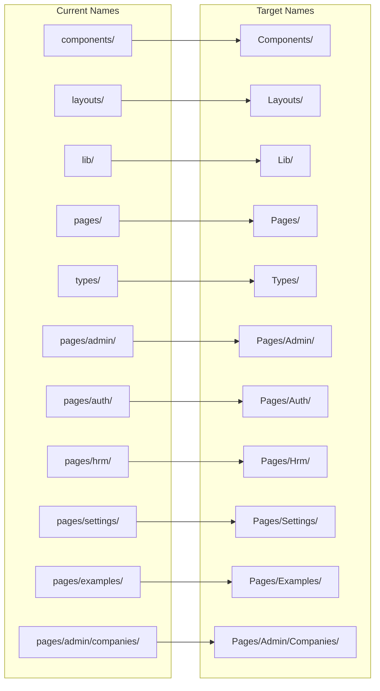

# Folder Renaming to PascalCase Design

## Overview

This design outlines a comprehensive strategy to rename all folders, subfolders, and files inside `resources/js` to PascalCase naming convention, while preserving files inside `components/ui/*` unchanged. This will standardize the codebase to follow consistent naming conventions across the frontend architecture.

## Architecture

### Current Structure Analysis

The current `resources/js` directory structure follows a mixed naming convention:

```
resources/js/
├── Hooks/ (already PascalCase)
├── app.tsx (camelCase)
├── components/ (camelCase)
│   ├── app-content.tsx (kebab-case)
│   ├── app-header.tsx (kebab-case)
│   ├── ui/ (camelCase - preserve contents)
│   └── ...
├── layouts/ (camelCase)
│   ├── App/ (PascalCase)
│   ├── Auth/ (PascalCase)
│   └── Settings/ (PascalCase)
├── lib/ (camelCase)
├── pages/ (camelCase)
│   ├── admin/ (camelCase)
│   ├── auth/ (camelCase)
│   ├── hrm/ (camelCase)
│   └── settings/ (camelCase)
├── ssr.tsx (camelCase)
└── types/ (camelCase)
```

### Target Structure (PascalCase)

The target structure will follow consistent PascalCase naming:

```
resources/js/
├── Hooks/ (unchanged)
├── App.tsx
├── Components/
│   ├── AppContent.tsx
│   ├── AppHeader.tsx
│   ├── ui/ (preserve all contents unchanged)
│   └── ...
├── Layouts/
│   ├── App/ (unchanged)
│   ├── Auth/ (unchanged)
│   └── Settings/ (unchanged)
├── Lib/
├── Pages/
│   ├── Admin/
│   ├── Auth/
│   ├── Hrm/
│   └── Settings/
├── Ssr.tsx
└── Types/
```

## Renaming Strategy

### Folder Mappings



### File Mappings

#### Root Level Files
| Current Name | Target Name |
|--------------|-------------|
| `app.tsx` | `App.tsx` |
| `ssr.tsx` | `Ssr.tsx` |

#### Component Files (kebab-case → PascalCase)
| Current Name | Target Name |
|--------------|-------------|
| `app-content.tsx` | `AppContent.tsx` |
| `app-header.tsx` | `AppHeader.tsx` |
| `app-logo-icon.tsx` | `AppLogoIcon.tsx` |
| `app-logo.tsx` | `AppLogo.tsx` |
| `app-shell.tsx` | `AppShell.tsx` |
| `app-sidebar-header.tsx` | `AppSidebarHeader.tsx` |
| `app-sidebar.tsx` | `AppSidebar.tsx` |
| `appearance-dropdown.tsx` | `AppearanceDropdown.tsx` |
| `appearance-tabs.tsx` | `AppearanceTabs.tsx` |
| `breadcrumbs.tsx` | `Breadcrumbs.tsx` |
| `chat-widget.tsx` | `ChatWidget.tsx` |
| `company-switcher.tsx` | `CompanySwitcher.tsx` |
| `delete-user.tsx` | `DeleteUser.tsx` |
| `heading-small.tsx` | `HeadingSmall.tsx` |
| `heading.tsx` | `Heading.tsx` |
| `icon.tsx` | `Icon.tsx` |
| `input-error.tsx` | `InputError.tsx` |
| `language-toggle.tsx` | `LanguageToggle.tsx` |
| `nav-footer.tsx` | `NavFooter.tsx` |
| `nav-main.tsx` | `NavMain.tsx` |
| `nav-user.tsx` | `NavUser.tsx` |
| `settings-dropdown.tsx` | `SettingsDropdown.tsx` |
| `text-link.tsx` | `TextLink.tsx` |
| `top-navigation.tsx` | `TopNavigation.tsx` |
| `user-info.tsx` | `UserInfo.tsx` |
| `user-menu-content.tsx` | `UserMenuContent.tsx` |

#### Hook Files (kebab-case → PascalCase)
| Current Name | Target Name |
|--------------|-------------|
| `use-appearance.tsx` | `UseAppearance.tsx` |
| `use-initials.tsx` | `UseInitials.tsx` |
| `use-language.ts` | `UseLanguage.ts` |
| `use-mobile-navigation.ts` | `UseMobileNavigation.ts` |
| `use-mobile.tsx` | `UseMobile.tsx` |

#### Layout Files
| Current Name | Target Name |
|--------------|-------------|
| `app-layout.tsx` | `AppLayout.tsx` |
| `auth-layout.tsx` | `AuthLayout.tsx` |
| `layouts/App/AppHeaderLayout.tsx` | `Layouts/App/AppHeaderLayout.tsx` (unchanged) |
| `layouts/App/AppSidebarLayout.tsx` | `Layouts/App/AppSidebarLayout.tsx` (unchanged) |
| `layouts/Auth/AuthCardLayout.tsx` | `Layouts/Auth/AuthCardLayout.tsx` (unchanged) |
| `layouts/Auth/AuthSplitLayout.tsx` | `Layouts/Auth/AuthSplitLayout.tsx` (unchanged) |
| `layouts/Auth/auth-simple-layout.tsx` | `Layouts/Auth/AuthSimpleLayout.tsx` |
| `layouts/Settings/Layout.tsx` | `Layouts/Settings/Layout.tsx` (unchanged) |

#### Page Files (kebab-case → PascalCase)
| Current Name | Target Name |
|--------------|-------------|
| `dashboard.tsx` | `Dashboard.tsx` |
| `simple-dashboard.tsx` | `SimpleDashboard.tsx` |
| `pages/admin/employment-types.tsx` | `Pages/Admin/EmploymentTypes.tsx` |
| `pages/admin/roles.tsx` | `Pages/Admin/Roles.tsx` |
| `pages/admin/security.tsx` | `Pages/Admin/Security.tsx` |
| `pages/admin/users.tsx` | `Pages/Admin/Users.tsx` |
| `pages/admin/companies/Index.tsx` | `Pages/Admin/Companies/Index.tsx` (unchanged) |
| `pages/admin/companies/create.tsx` | `Pages/Admin/Companies/Create.tsx` |
| `pages/admin/companies/edit.tsx` | `Pages/Admin/Companies/Edit.tsx` |
| `pages/admin/companies/show.tsx` | `Pages/Admin/Companies/Show.tsx` |
| `pages/auth/confirm-password.tsx` | `Pages/Auth/ConfirmPassword.tsx` |
| `pages/auth/forgot-password.tsx` | `Pages/Auth/ForgotPassword.tsx` |
| `pages/auth/login.tsx` | `Pages/Auth/Login.tsx` |
| `pages/auth/register.tsx` | `Pages/Auth/Register.tsx` |
| `pages/auth/reset-password.tsx` | `Pages/Auth/ResetPassword.tsx` |
| `pages/auth/simple-login.tsx` | `Pages/Auth/SimpleLogin.tsx` |
| `pages/auth/verify-email.tsx` | `Pages/Auth/VerifyEmail.tsx` |
| `pages/hrm/attendance.tsx` | `Pages/Hrm/Attendance.tsx` |
| `pages/hrm/banks.tsx` | `Pages/Hrm/Banks.tsx` |
| `pages/hrm/departments.tsx` | `Pages/Hrm/Departments.tsx` |
| `pages/hrm/employees.tsx` | `Pages/Hrm/Employees.tsx` |
| `pages/hrm/leaves.tsx` | `Pages/Hrm/Leaves.tsx` |
| `pages/hrm/payroll.tsx` | `Pages/Hrm/Payroll.tsx` |
| `pages/settings/appearance.tsx` | `Pages/Settings/Appearance.tsx` |
| `pages/settings/password.tsx` | `Pages/Settings/Password.tsx` |
| `pages/settings/profile.tsx` | `Pages/Settings/Profile.tsx` |
| `pages/examples/delete-modal-examples.tsx` | `Pages/Examples/DeleteModalExamples.tsx` |

#### Library Files
| Current Name | Target Name |
|--------------|-------------|
| `lib/i18n.ts` | `Lib/I18n.ts` |
| `lib/utils.ts` | `Lib/Utils.ts` |

#### Type Files
| Current Name | Target Name |
|--------------|-------------|
| `types/global.d.ts` | `Types/Global.d.ts` |
| `types/index.d.ts` | `Types/Index.d.ts` |
| `types/vite-env.d.ts` | `Types/ViteEnv.d.ts` |

### Excluded Areas

The following areas will remain unchanged:
- All contents within `components/ui/*` directory
- File contents and internal code logic
- Import statements will be updated automatically by the renaming process

## Implementation Strategy

### Phase 1: Folder Structure Renaming
1. Rename top-level directories:
   - `components/` → `Components/`
   - `layouts/` → `Layouts/`
   - `lib/` → `Lib/`
   - `pages/` → `Pages/`
   - `types/` → `Types/`

2. Rename nested directories:
   - `pages/admin/` → `Pages/Admin/`
   - `pages/auth/` → `Pages/Auth/`
   - `pages/hrm/` → `Pages/Hrm/`
   - `pages/settings/` → `Pages/Settings/`
   - `pages/examples/` → `Pages/Examples/`
   - `pages/admin/companies/` → `Pages/Admin/Companies/`

### Phase 2: File Renaming
1. Root level files
2. Component files (excluding ui/ contents)
3. Hook files
4. Layout files
5. Page files
6. Library files
7. Type definition files

### Phase 3: Reference Updates
The IDE/editor will automatically update import statements and references when files are renamed through the file system.

## Impact Analysis

### Affected Systems
1. **Import Statements**: All import statements referencing renamed files will need updates
2. **Inertia Page Resolution**: Laravel controllers using `Inertia::render()` will need path updates
3. **Vite Configuration**: Build tool configuration may need path updates
4. **TypeScript Configuration**: Path aliases might need adjustments

### Files That Will Require Manual Updates
1. **Laravel Controllers**: All controllers that render Inertia pages
2. **Route Files**: Any dynamic imports or page references
3. **Vite Configuration**: If using specific path mappings
4. **TypeScript Configuration**: Path aliases in `tsconfig.json`

### Zero-Impact Areas
- `components/ui/*` files remain completely unchanged
- Database schemas and migrations
- Backend model relationships
- API endpoints and authentication logic

## Risk Mitigation

### Version Control Strategy
1. Create a feature branch for the renaming process
2. Commit changes in logical phases (folders first, then files)
3. Test functionality after each phase
4. Maintain rollback capability

### Testing Strategy
1. Verify application builds successfully after each phase
2. Test key user flows (login, dashboard, core features)
3. Validate SSR functionality remains intact
4. Check hot module replacement in development

### Rollback Plan
If issues arise:
1. Use git to revert specific commits
2. Restore from the pre-renaming branch
3. Apply changes incrementally with smaller scope

## Post-Implementation Validation

### Verification Checklist
- [ ] Application builds without errors
- [ ] All pages load correctly
- [ ] Navigation between pages works
- [ ] SSR functionality intact
- [ ] Hot reload works in development
- [ ] TypeScript compilation successful
- [ ] No broken imports or missing files
- [ ] UI components render correctly
- [ ] File structure follows PascalCase consistently

### Performance Validation
- [ ] Build time remains acceptable
- [ ] Bundle size unchanged
- [ ] Page load times unaffected
- [ ] Development server startup time consistent